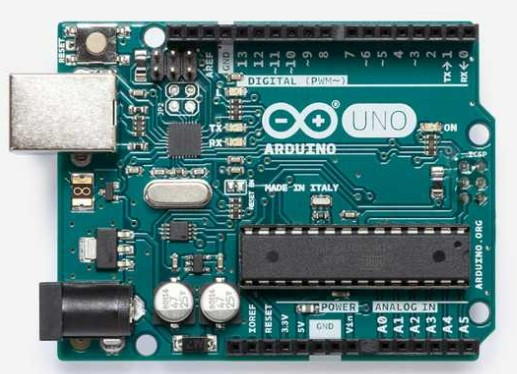
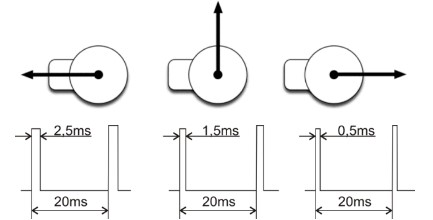
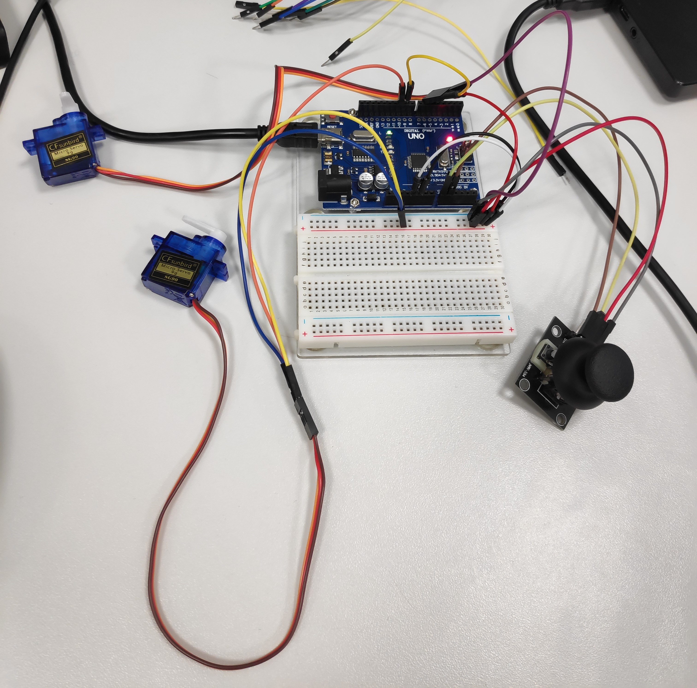
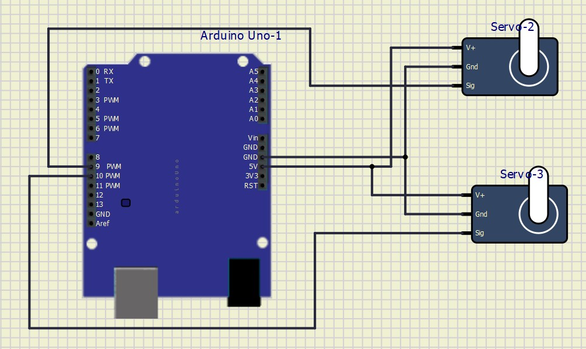

# Project 2

Precise generation of several PWM channels. Application of two (or more) Servo motors SG90.

## Instructions

The goal of the project is cooperation in pairs, further study of the topic, design of own solutions, implementation, creation of project documentation and presentation of results. The division of roles and tasks within the team is up to their members.

* Students work on a project in the labs during the 12th and 13th weeks of the semester.

* Through the BUT e-learning, students submit a link to the GitHub repository, which contains the complete project in PlatfomIO and a descriptive README file. The submission deadline is the day before the next laboratory, i.e. in 2 weeks.

* The source code for the AVR must be written in C and/or Assembly and must be implementable on Arduino Uno board using toolchains from the semester, ie PlatformIO and not in the Arduino-style. No other development tools are allowed.

## Recommended GitHub repository structure

   ```c
   YOUR_PROJECT        // PlatfomIO project
   ├── include         // Included files
   │   └── timer.h
   ├── lib             // Libraries
   │   └── gpio
   │        ├── gpio.h
   │        └── gpio.c
   ├── src             // Source file(s)
   │   └── main.c
   ├── test            // No need this
   │   └── README.md   // Report of this project
   └── platformio.ini  // Project Configuration File
   ```

## Recommended README.md file structure

### Team members

* Jakub Drápal (responsible for xxx)
* Martin Borski (responsible for xxx)

## Hardware description

### Arduino Uno

Arduino Uno is a microcontroller development board based on the ATmega328P. This board has 14 digital input/output pins (also 6 of them can be used as PWM), 6 analog input/output pins, 16MHz ceramic resonator, reset button, a power jack, an ICSP header and a USB connection.



### Servo motor

Servo motory slouží pro nastavení určité polohy ovládaného mechanizmu a následné držení v této poloze. Stejnosměrné servo motory se využívají například pro ovládání robotické paže nebo pro nastavení kormidla u leteckých modelů. Jejich hlavní výhodou je malý rozměr a malá hmotnost s relativně velkou silou.

Tyto motory obvykle neumožňují otáčení neustále dokola, ale udržují nastavený úhel natočení. Úhel se pohybuje nejčastěji v rozsahu 0° až 180°. Nastavení tohoto úhlu se provádí zasláním impulsu o určité délce. Neutrální poloha (90°) odpovídá obvykle délce impulsu 1,5ms. Délka 0,5ms odpovídá úhlu 0° a impuls délky 2,5ms nastavuje úhel 180°. Impulsy se posílají motoru pravidelně každých 20ms.



Stejnosměrný servo motor má obvykle tři vývody. Jeden pro napájení (obvykle červený), připojuje se na +5V, druhý pro uzemnění (černý nebo hnědý), připojuje se na GND a třetí pro příjem ovládacích impulsů (žlutý nebo oranžový), připojuje se obvykle na digitální piny, v našem případě ale na PWM piny.

#### Zapojení ve cvičení



#### Zapojení v simulide



## Software description

Put flowchats of your algorithm(s). Write descriptive text of your libraries and source files. Put direct links to these files in `src` or `lib` folders.

## Video

Insert a link to a short video with your practical implementation example (1-3 minutes, e.g. on YouTube).

## References

1. Write your text here.
2. ...