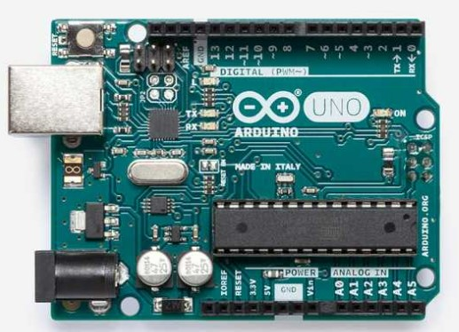

# Arduino Uno project

Application of analog joy-stick (2 ADC channels, 1 push button), rotary encoder, and Digilent PmodCLP LCD module.

### Team members

* Jakub Drápal ...
* Martin Borski ...

## Instructions

The goal of the project is cooperation in pairs, further study of the topic, design of own solutions, implementation, creation of project documentation and presentation of results. The division of roles and tasks within the team is up to their members.

* Students work on a project in the labs during the 10th and 11th weeks of the semester.

* Through the BUT e-learning, students submit a link to the GitHub repository, which contains the complete project in PlatfomIO and a descriptive README file. The submission deadline is the day before the next laboratory, i.e. in 2 weeks.

* The source code for the AVR must be written in C and/or Assembly and must be implementable on Arduino Uno board using toolchains from the semester. No other development tools are allowed.

## Recommended GitHub repository structure

   ```c
   YOUR_PROJECT        // PlatfomIO project
   ├── include         // Included files
   │   └── timer.h
   ├── lib             // Libraries
   │   ├── gpio        // gpio library folder
   │   │   ├── gpio.c  
   │   │   └── gpio.h  
   │   └── lcd         // lcd library folder
   │        ├── lcd_definitions.h
   │        ├── lcd.c
   │        └── lcd.h
   ├── src             // Source file(s)
   │   └── main.c
   ├── test            // No need this
   ├── platformio.ini  // Project Configuration File
   └── README.md       // Report of this project
   ```

## Hardware description

### Arduino Uno

Arduino Uno is a microcontroller development board based on the ATmega328P. This board has 14 digital input/output pins (also 6 of them can be used as PWM), 6 analog input/output pins, 16MHz ceramic resonator, reset button, a power jack, an ICSP header and a USB connection.



### Analog joystick

Analog joystick is a module, which allows us to scan a motion of 2 directions (X, Y). This joystick is consisted of two potentiometers of 10k Ohm resistivity and push button. It communicates with controller by the change of voltage.


### Rotary encoder

A rotary encoder is a type of position sensor which is used for determining the angular position of a rotating shaft. It generates an electrical signal, either analog or digital, according to the rotational movement.


The outcome of rotary encoder are two square wave signals (A a B) mutually phased by 90 deg.


 If signals A and B have the same values, the rotation is clockwise. If the signals have different values, the rotation is counter clockwise.


### Digilent PmodCLP LCD module

The Pmod CLP is a 16x2 character LCD module. Users provide 8 bits of data in parallel to display a variety of characters (192 predefined characters including 93 ASCII characters) on the screen.


## Software description

| **Library name** | **Brief description** | **Usage in our code** |
   | :-: | :-: | :-: |
   | GPIO  | Allowing high performance digital pin access | Setting Input/Output of a pin and reading its values |
   | LCD   | Necessary functions for controlling the display | Initialization of module itself, writing values/strings on exact positions |
   | Timer | Hardware block within an MCU and can be used to measure time events | Determination of refresh time of display and code cycle, also allows us to interrupt |

   ### Source files & libraries

 1. **Timer:** [timer.h](https://github.com/jdrapal/digital-electronics-2/blob/main/09-project1/include/timer.h)
 2. **Gpio:** [gpio.c](https://github.com/jdrapal/digital-electronics-2/blob/main/09-project1/lib/gpio/gpio.c), [gpio.h](https://github.com/jdrapal/digital-electronics-2/blob/main/09-project1/lib/gpio/gpio.h)
 3. **LCD:** [lcd.c](https://github.com/jdrapal/digital-electronics-2/blob/main/09-project1/lib/lcd/lcd.c), [lcd.h](https://github.com/jdrapal/digital-electronics-2/blob/main/09-project1/lib/lcd/lcd.h), [lcd_definitions.h](https://github.com/jdrapal/digital-electronics-2/blob/main/09-project1/lib/lcd/lcd_definitions.h)
 4. **Source:** [main.c](https://github.com/jdrapal/digital-electronics-2/blob/main/09-project1/src/main.c)

Put flowchats of your algorithm(s). Write descriptive text of your libraries and source files. Put direct links to these files in `src` or `lib` folders.

## Video

Insert a link to a short video with your practical implementation example (1-3 minutes, e.g. on YouTube).

## References

1. Write your text here.
2. ...